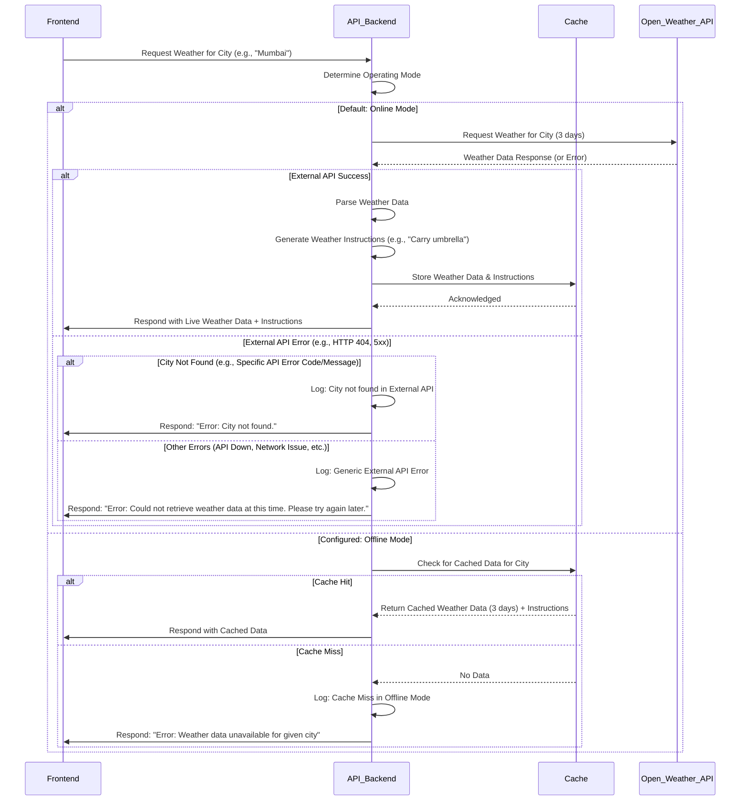

# WeatherPrediction Api

Contains API to fetch weather prediction for a given city in ONLINE mode using OpenWeather API and in OFFLINE mode using cached data.

**Port:** 8080

**Docker image:** weather-prediction-app:latest

# API Documentation

- `[GET] /weather?city={cityName}` Fetches weather prediction for a given city. If the city is not found, it returns a 404 error. If the city is found, it returns a 200 response with the weather data. 
   The API is available both in OFFLINE and ONLINE modes.
   In ONLINE mode, it fetches the data from OpenWeather API using the provided API key.
   In OFFLINE mode, it fetches the data from a local cache.
   Default mode is ONLINE, but it can be switched to OFFLINE leveraging the below API.
- `[POST] /mode/{modeName}` Switches the API to provided mode(ONLINE/OFFLINE)

Open API documentation is available at `src/main/resources/openapi.yaml` 
and the swagger documentation at `http://localhost:8080/swagger-ui.html`.

# Steps to run the build, unit and integration tests

mvn clean install

# Steps to run the application

Create a Run/debug configuration in your IDE with the following options:

- provide main class as `com.ps.weather_prediction.WeatherPredictionApplication`
- provide an environment variable `OPEN_WEATHER_API_KEY`

Run this configuration and the application will start on port 8080.
Access the APIs at `http://localhost:8080/weather?city=<CITY_NAME>` or via postman or via swagger UI at `http://localhost:8080/swagger-ui.html`.

# Steps to run the application in Docker

Build the Docker image using the following command:

`docker build -t weather-prediction-app:latest .`

Run the Docker container using the following command:

`docker run -e OPEN_WEATHER_API_KEY=<api_key> -p 8080:8080 weather-prediction-app:latest`

The application will start on port 8080.
Access the API at `http://localhost:8080/weather?city=<CITY_NAME>` or via postman or via swagger UI at `http://localhost:8080/swagger-ui.html`.

# Sequence Diagram

